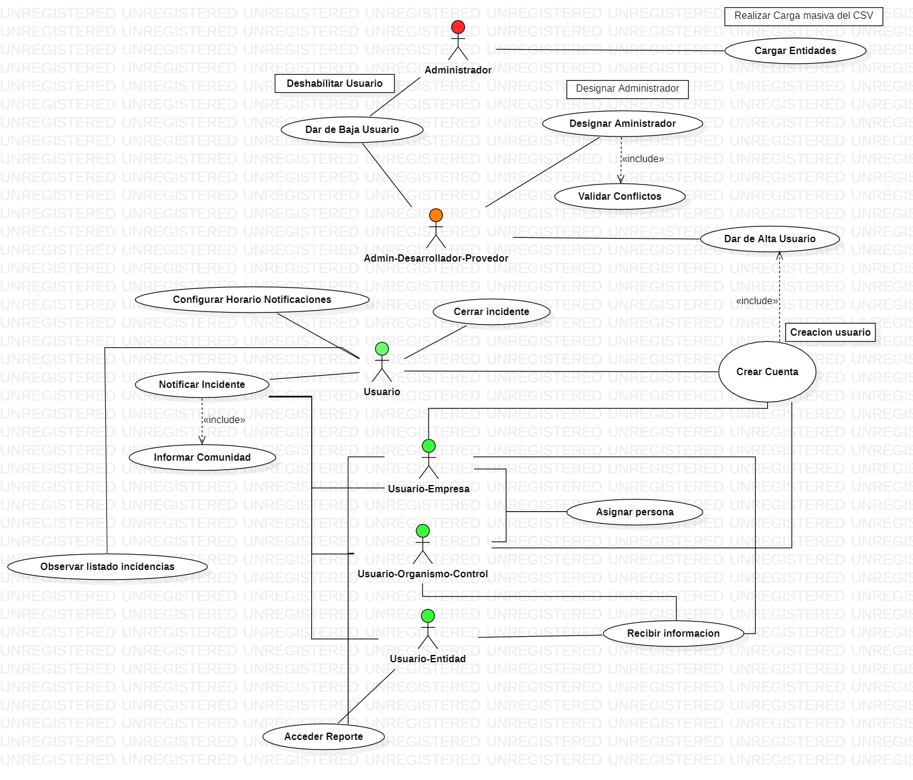

# Casos de uso 

> En esta carpeta se visulizara el casos de uso, mas las explicaciones de las decisiones tomadas en cada una de las entregas 

# Entrega 1

## Actores

* Administrador (Usuario/Provedor)
* Administrador
* Usuario

## Casos de Usuario

1.  Crear Cuenta
* Depende de Dar de alta

## Casos de Uso Adminitrador (Desarrollador/Provedor)
1. Designar Administrador
* Incluye validar conflictos
2. Dar de Baja usuario

## Casos de Uso Administrador

Este seria el que tiene control de las comunidades en la plataforma

1. Dar de Baja Usuario

No se solicita ser administrador por que lo designa el proveedor de la plataforma

## Aclaraciones

Para esta entrega no se evalua que el usuario ni que el administrador tengan algun contacto con las publicaciones ya se dar de baja o realizar alguna publicacion .

# Entrega 2

## Entidades

* Usuario
* Administrador
* Admin-Desarollador-Proveedor

### Nuevas entidades

* Usuario-Empresa
* Usuario-Organismo-control
* Usuario-Entidad

## Explicaciones

El Usuario Empresa como el usuario de organismos de control son los que asignaran una persona en el caso de que haya algun inconveniente en alguna servicio.
Designaran a un usuario dentro de la platarforma para que los solucione.

Estos usuario tambien tendran que crear las cuentas como usuarios normales para pertenecer.

Al usuario Normal se le asigna un nuevo caso de uso que es la notificacion de problemas, para que las demas puedan ser notificados del mismo

Por ultimo usuario Entidad ( que seria el "propietario" duenio del lugar) es el que tendria que cargar el establecimiento para que pueda figurar en el mismo sistema,
Este establecimiento agregado tiene que ser validado, para que sea correcto y cumpla con los requisitos para poder incorporarse , la cual es un Caso de uso para el administrador.

Se agrega un caso de uso que sera la carga del csv , que hara referencia para el administrador haga la carga masiva del mismo

Por ultimo tenemos el caso de uso de recibir informacion el cual seria notificar a los usuarios que corresponde que el usuario notifico de algun error.

# Entrega 3

* Persona(usuario)
    * Informar incidencia
        * Informar miembros
    * Observar listado
    * Cargar Funcionalidades
    * Cerrar Incidente
    * Configurar Horario notificaciones
* Entidades proveedoras
    * Acceder Reporte (incidencias)
    * Crear Incidencia

* [Casos-De-Uso](./3-Casos-De-Uso.mdj)

