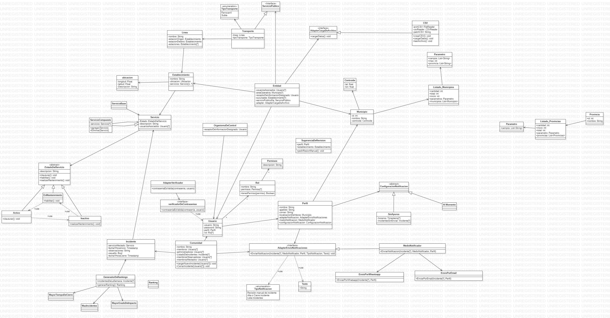

# Justificacion Entrega 3 

## Imagen del diagrama 

## Justificacion 

* Los incidentes los obtenemos directamente de la comunidad para evitar el conflicto de mezcla de comunidades a la hora de analizar  validez, envio de notificaciones y revision manual del servicio
* El tema del servicio base o compuesto decidimos dejar nuestra solucion tal cual estaba ya que se considero que no era de suma relevancia esa distincion
