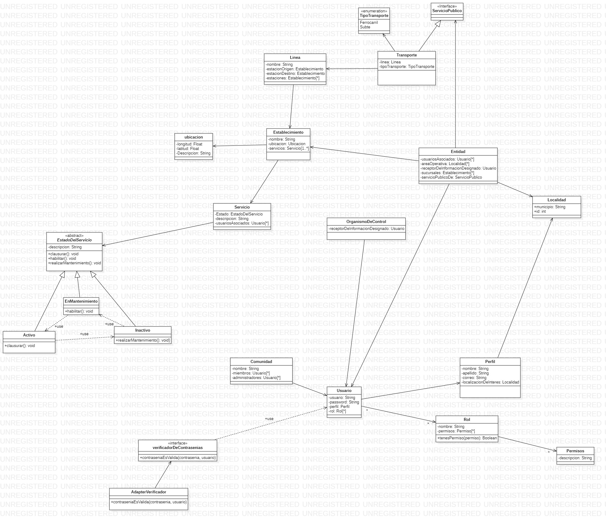

# Diagrama de clases 

* [diagrama-de-clases](./DiagramaDeClasesEntrega2.mdj)

## Imagen del diagrama 

## Justificacíon

* Se establece la clase ServicioPublico para la integracion de futuros servicios.
* Los transporte implementa servicio publico.
* Se establece la clase entidad que representa a las empresas prestadoras del servicio. Las entidades conocen el servicio publico que brindan, el area(localidad) donde operan, sus sucursales(establecimientos) y sus usuarios asociados. La entidad conoce los usuarios y no al revés para no tener que buscar a qué usuarios mandar información.
* Se establece la clase organismo de control.
* Organismo de control y entidad conocen un usuario receptor de informacion.
* Las estaciones pasan a ser establecimientos.
* Se agregó la clase localidad para las áreas de interés. Se agrega esta clase para obtener consistencia de datos. No utilizamos la clase ubicación ya que esta se usa para obtener la ubicación precisa de un establecimiento y no para un área.
* Cambia la estructura usada para los usuarios. Cada usuario tendrá asociado un perfil(data class) y a su vez, perfil tendrá asociado un rol con sus determinados permisos. 
* Se eliminan las clases con roles dentro de la aplicación(Administrador, miembro proveedor). Se agrega la clase rol que contiene la lista de permisos para cada rol. Por ejemplo, administrador será una instancia de rol de un perfil asociado a un usuario quien tendrá sus respectivos métodos en la capa de Controlador.
* La clase usuario conoce los roles.
* En Comunidad la lista de miembros y de administradores pasan a ser de tipo usuario para corresponder con los cambios mencionados.

